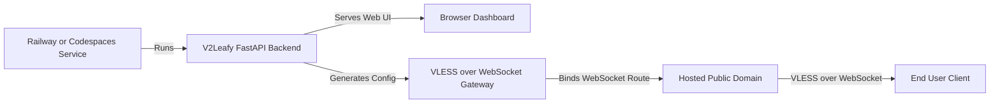

<div align="center">

# V2Leafy

A sleek **web dashboard** for managing a FastAPI-powered VLESS WebSocket gateway on Railway and GitHub Codespaces.

[](LICENSE)
[](https://github.com/Code-Leafy/V2Leafy/stargazers)
[](https://python.org)
[](https://fastapi.tiangolo.com)
[](https://railway.com)

</div>

---

## Overview

V2Leafy is one clean FastAPI application that runs on Railway, GitHub Codespaces, and local development with a single listener, one adaptive frontend, and a **WebSocket-only VLESS** proxy transport. It serves a responsive purple dashboard for client management, subscription generation, traffic monitoring, and gateway controls.

Once the Python backend starts, it serves the full dashboard through the hosting provider’s public web service. From there you can manage clients, preview generated configs, copy subscription links, view logs, monitor usage, and control the gateway — no terminal UI required.

> **Note:** V2Leafy intentionally unifies the old G2Leafy/R2Leafy split into a single app. Elements removed or changed in the frontend are part of that consolidation and are not restored by UI synchronization.

---

<details open>
<summary><kbd>Platform Deployment Options</kbd></summary>

V2Leafy supports hosted Python deployments. `railway.json` is ready for Railway (it installs `requirements.txt`, generates a `SECRET_KEY`, and starts `python main.py`). GitHub Codespaces builds from `.devcontainer` and forwards port `8080` as public. The same repository runs locally with `python main.py`.

</details>

---

## Core Features

### Web Dashboard Control Panel

Manage everything from a clean browser UI instead of a terminal. Create clients, edit limits, view QR codes, copy subscription links, restart the gateway, and monitor it from one dashboard.

### VLESS WebSocket Config Generation

Generate VLESS client links and subscription outputs for the public domain assigned by Railway, Codespaces, or another compatible host. The gateway binds to `0.0.0.0` and uses the hosting provider’s `PORT` variable for the web service.

### Live Analytics & Usage

Real-time RX/TX consumption, connection status, gateway uptime, memory allocation, client usage, and active connections — streamed to the dashboard over WebSocket.

### Subscription Lab

Build custom per-client subscription layouts directly in the web panel. Add **Proxy (WebSocket)** nodes and **Info** announcement rows, with placeholders, custom names, usage indicators, and a live mobile-style preview.

### First-Run Password Setup

On the first start, V2Leafy shows a themed setup screen that asks you to create and confirm a password. The password is stored as a PBKDF2-HMAC-SHA256 hash in the runtime state; later starts use the login screen and an HTTP-only session cookie.

### Responsive Hosted Deployment

Run the same FastAPI application locally or deploy it to Railway and Codespaces. The dashboard is designed for desktop and mobile browsers, with backend-owned themes (purple on Railway, neutral grey on Codespaces) and no platform-specific UI.

<div align="center">

| Configuration Optimizer |
| :--- |
| To finalize your setup, take the config received from the panel and visit **[NetLeafy](https://code-leafy.github.io/NetLeafy)**. Set the server mode to **V2Leafy** and paste your link to generate a fully optimized connection. |

</div>

---

## Quick Start

### 1. Railway (GitHub Deployment)

*No local installation required.*

1. **Fork the Repository**: Open [Code-Leafy/V2Leafy](https://github.com/Code-Leafy/V2Leafy) and click **Fork**.
2. **Create a Railway Project**: Sign in to [Railway](https://railway.com/), click **New Project**, and choose **Deploy from GitHub repo**.
3. **Select V2Leafy**: Authorize GitHub if requested, then select your fork of the `V2Leafy` repository.
4. **Confirm the Start Command**: Railway reads `railway.json` and starts `python main.py`. The tracked `Procfile` also specifies `web: python main.py`.
5. **Add the Secret Key**: `railway.json` generates `SECRET_KEY` automatically. If your deployment skips it, add a strong random value in the service **Variables** tab.
6. **Deploy**: Open the **Deployments** tab and wait for the build and deployment logs to show the service is running.
7. **Generate a Domain**: Open **Settings → Networking**, choose **Generate Domain**, and copy the HTTPS URL.
8. **Create Your Password**: Open the generated URL. On the first start, use the V2Leafy setup screen to create and confirm your password.
9. **Use the Dashboard**: After setup, the dashboard loads and prints the hosted domain in generated links and subscriptions.

> Railway automatically provides `PORT`. V2Leafy listens on `0.0.0.0` and uses that assigned port. Do not hard-code a production port.

### 2. GitHub Codespaces

1. **Fork the Repository**: Fork the V2Leafy repository to your GitHub account.
2. **Open a Codespace**: From the repository, click **Code → Codespaces → Create codespace on main**.
3. **Let It Build**: `.devcontainer` installs the dependencies into a virtualenv and starts `python main.py`.
4. **Confirm the Port**: The `.devcontainer` config forwards port `8080` as **public**; the app also self-heals the public visibility at startup.
5. **Open the Service**: Open the forwarded public URL — the dashboard appears in the Codespaces "Ports" panel.
6. **Create Your Password**: Complete the first-run V2Leafy password setup screen.

### 3. Local Development

From the `V2Leafy` directory:

```bash
python -m venv .venv
```

Activate the environment and install dependencies:

```bash
# macOS/Linux
source .venv/bin/activate

# Windows
.venv\Scripts\activate

pip install -r requirements.txt
python main.py
```

Open the local URL printed by the backend. For local development, `PORT` defaults to `8080`; set `SECRET_KEY` to a stable random value if you need sessions to survive restarts.

---

## Usage

When launched, the backend serves the dashboard and uses the host-provided public domain when available.

```bash
# Start the backend directly
python main.py
```

Then open your local or hosted dashboard URL in a browser:

```text
https://<your-hosted-domain>/
```

Inside the web dashboard you can:

- Create the first admin password and log in through the protected auth overlay.
- View live traffic, speed, uptime, and hardware usage from **Dashboard**.
- Create, edit, enable, disable, delete, and QR-share clients from **Client Profiles**.
- Build custom per-client subscriptions from **Subscription Lab**.
- Copy VLESS links for any subscription entry directly from the panel.
- View gateway and panel logs from **Console Logs**.

> The web dashboard and the generated VLESS client traffic use the host’s public domain and port. Use the generated VLESS or subscription link in a compatible client instead of treating the proxy endpoint as a normal website route.

---

## Architecture



<details>

<summary><kbd>Project Structure</kbd></summary>

```text
V2Leafy/
├── index.html       # Adaptive web dashboard (backend-driven theme/platform)
├── main.py          # FastAPI backend, auth, API, proxy, and subscriptions
├── static/vendor/   # Self-hosted FontAwesome, Chart.js, QRCode.js, fonts (+ SRI)
├── gunicorn_config.py # Multi-worker template (single worker recommended — see notes)
├── requirements.txt # Python dependencies
├── Procfile         # Compatible process command (web: python main.py)
├── railway.json     # Railway configuration (build, secrets, healthcheck)
├── .devcontainer/   # Codespaces configuration
├── README.md        # Setup, deployment, usage, and FAQ
├── LICENSE          # MIT license
└── .gitignore       # Runtime and secret exclusions
```

</details>

---

## Security Notes

- **Password hashing**: PBKDF2-HMAC-SHA256 with a per-setup salt; only the hash is stored.
- **Sessions**: HTTP-only, SameSite=Lax cookies held in memory; never persisted. Tokens rotate every 30 minutes to prevent fixation.
- **Rate limiting**: `/api/login` and `/api/setup` allow 5 attempts/minute/IP (sliding window; `LOGIN_RATE_LIMIT`).
- **CSRF**: all state-changing API calls require the `X-CSRF-Token` header (derived from the session and embedded in the page bootstrap). Login/setup additionally require a same-origin `Origin`/`Referer`.
- **Headers**: CSP (`default-src 'self'`), `X-Content-Type-Options: nosniff`, `X-Frame-Options: DENY`, strict `Referrer-Policy`, HSTS over HTTPS, and the `Server` header is neutralized.
- **Validation**: Pydantic v2 everywhere (lengths, bounds, enums, body-size cap), `{uid}`/`{client_id}` path params must match a UUID, and the VLESS header parser enforces RFC 1123 FQDN rules with hard caps.
- **Tunnel auth**: every VLESS client link carries a per-client WS query token (`?token=…`) as a second factor; unparseable headers, wrong tokens, and unknown UUIDs are answered with an nginx-style fallback page instead of error codes.
- **Assets**: FontAwesome, Chart.js, QRCode.js and the two UI fonts are bundled under `static/vendor/` with SRI hashes and immutable caching — no runtime CDN dependency.
- **IP visibility**: the dashboard's live connection inspector shows peer IPs (and optional geo flags). `GEO_LOOKUP=0` disables geo lookup. Peer IPs are kept in memory only and never persisted to state.

---

## Operational Notes (hardening backlog)

### Platform constraints

- **UDP forwarding (VLESS command 2)**: implemented, but **disabled by default** (`UDP_FORWARDING=1` enables it). Railway's edge does not support outbound UDP, so command-2 connections will fail to dial there (clean close, no crash). Codespaces and local hosts generally allow it. Mainstream xray-based clients cannot carry UDP over WebSocket reliably, so treat this as experimental.
- **Multi-worker**: see `gunicorn_config.py`. Sessions, in-memory state and the connection table are per-process, so **keep `workers = 1`** on Railway (memory persistence) and on file-backed hosts unless you move sessions/state to a shared store.
- **Handshake padding (`HANDSHAKE_PADDING_MAX`)**: the legacy xray `?ed=` WebSocket padding protocol was removed from all modern clients (xray/v2ray/sing-box), so this knob is only meaningful for legacy clients that request `ed`; default `0` (off).

### Environment variables

| Variable | Default | Purpose |
| --- | --- | --- |
| `SECRET_KEY` | dev fallback | Session/CSRF signing key (always set in production) |
| `LOG_FORMAT` | `text` | `json` emits structured `{timestamp, level, msg, client_id}` lines for Datadog/Loki/ELK |
| `LOGIN_RATE_LIMIT` | `5` | Login/setup attempts per minute per IP |
| `TCP_CONNECT_TIMEOUT` / `TCP_FIRST_BYTE_TIMEOUT` / `TCP_IDLE_TIMEOUT` | `5` / `10` / `300` | Split connection timeouts (s) |
| `RELAY_QUEUE_MAX` | `8` | Bounded WS send queue (frames) — caps memory on slow readers |
| `UDP_FORWARDING` | `0` | Enable experimental VLESS UDP forwarding |
| `HANDSHAKE_PADDING_MAX` | `0` | Legacy `ed`-padding support (see constraints) |
| `QUOTA_RESET_CYCLE` | `none` | `monthly` or `weekly` billing cycles for auto quota resets |
| `QUOTA_RESET_MONTHLY_DAY` / `QUOTA_RESET_HOUR_UTC` | `1` / `0` | Monthly reset day-of-month and hour (UTC) |
| `MEMORY_WATCHDOG_PCT` / `MEMORY_WATCHDOG_MB` | `80` / `0` | Restart process when RSS exceeds container limit % or absolute MB |
| `ALERT_WEBHOOK_URL` / `ALERT_WEBHOOK_TYPE` | – / `discord` | Alert webhook (`discord` or `telegram` + `TELEGRAM_CHAT_ID`) for mem > 90% / CPU 5-min avg > 85% |
| `GEO_LOOKUP` | `1` | Resolve peer IPs to country flags via ip-api.com (cached, best-effort) |
| `PROMETHEUS` | `1` | Expose `/metrics` (traffic, connections, per-client gauges, system) |

### Endpoints added

- `GET /health/ready` — state read/write, listener, disk %, gateway status.
- `GET /metrics` — Prometheus text format.
- `POST /api/links/{uid}/token` — rotate a client's WS tunnel token (revoke old links).
- `POST /api/links/{uid}/sub-slug` — regenerate a client's subscription slug without touching the UUID.
- `POST /api/connections/{conn_id}/kill` — terminate a live tunnel connection.
- `GET /sub/token_xxx` — subscriptions served via revocable slugs; `Subscription-Userinfo` carries exact `upload`/`download`/`total`/`expire` byte values; output is RFC 4648 base64 with CRLF separators and ETag/304 support.

---

<details>

<summary><kbd>FAQ</kbd></summary>

### Is this still a TUI/curses panel?

No. V2Leafy uses a **web panel dashboard**. The terminal is only used to start the Python backend and inspect deployment logs.

### Where do I open the panel on Railway?

After deployment, open **Settings → Networking → Generate Domain** in Railway. Use the generated HTTPS domain in your browser.

### Where do I open the panel on Codespaces?

Switch to the **Ports** tab of the Codespace and open the forwarded `8080` public URL.

### What password do I use on the first launch?

There is no hard-coded default password. On the first start, V2Leafy displays the setup screen and asks you to create and confirm one. Later starts use the login screen.

### Why does Railway show a deployment port warning?

Make sure the service starts with `python main.py`. V2Leafy binds to `0.0.0.0` and reads Railway’s injected `PORT` variable. Do not hard-code `8080` or another production port.

### Why should I set `SECRET_KEY` on hosted deployments?

Always define `SECRET_KEY` before deploying. Railway generates it via `railway.json`; on other hosts, set it manually in the service Variables tab. This key protects session signing. The development fallback is not suitable for a public deployment.

### Are V2Leafy, G2Leafy, and R2Leafy the same project?

They share common dashboard language, but V2Leafy is the unified single-app version that replaces the older G2Leafy/R2Leafy split. Removed elements and changed layouts are intentional.

### Is this project production-ready by default?

You must configure a strong `SECRET_KEY`, use HTTPS, create a strong dashboard password, and review your hosting provider’s terms before using it. Never commit runtime state, credentials, API tokens, or private configuration files.

</details>

<br>

<div align="center">

> **Educational Purpose Only:** This project is provided for educational and research purposes. Users are solely responsible for compliance with all local laws. The developer assumes no liability for misuse.

[MIT License](https://github.com/Code-Leafy/V2Leafy/blob/main/LICENSE) · Crafted by [Code-Leafy](https://github.com/Code-Leafy)

</div>
